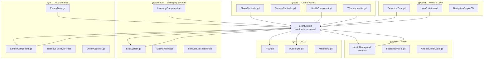

# 🏗️ Arquitectura — Escape From Zona Sur

> Godot 4.4 · GDScript · Extraction Shooter

---

## 1. Principio de diseño: EventBus-first

Todos los sistemas se comunican **únicamente** a través del autoload `EventBus.gd`.
Ningún sistema tiene una referencia directa a otro sistema de un agente distinto.

```
✅ CORRECTO
HealthComponent → EventBus.health_changed.emit(current, max)
HUD             ← EventBus.health_changed.connect(_update_health_bar)

❌ INCORRECTO
HUD.get_node("/root/Player/HealthComponent").health
```

**Beneficio directo:** los 7 agentes pueden trabajar en ramas Git paralelas sin conflictos de merge, ya que cada rama solo toca su propio módulo y señaliza a través de EventBus.

---

## 2. Jerarquía de sistemas



---

## 3. Estructura de carpetas

```
EscapeFromZonaSur/
│
├── project.godot                  # Config Godot 4.4, autoloads, input map
├── .gitignore                     # Ignora .godot/, *.import, exports/
│
├── src/                           # Todo el código GDScript
│   ├── autoloads/
│   │   ├── EventBus.gd            # ★ Señales tipadas — eje de comunicación
│   │   └── GameState.gd           # Estado del raid: timer, jugador vivo, etc.
│   │
│   ├── player/
│   │   ├── PlayerController.gd    # CharacterBody3D FPS (movimiento + salto)
│   │   ├── CameraController.gd    # Mouse look + head bob
│   │   ├── HealthComponent.gd     # Reutilizable: player y enemies
│   │   └── WeaponHandler.gd       # Equip / fire / reload
│   │
│   ├── enemies/
│   │   ├── EnemyBase.gd           # CharacterBody3D base
│   │   ├── SensorComponent.gd     # Visión + sonido
│   │   ├── EnemySpawner.gd
│   │   ├── bt_actions/            # Hojas Beehave (ActionLeaf)
│   │   │   ├── MoveToTarget.gd
│   │   │   ├── ShootAtTarget.gd
│   │   │   └── PatrolPoint.gd
│   │   └── bt_conditions/         # Hojas Beehave (ConditionLeaf)
│   │       ├── CanSeePlayer.gd
│   │       ├── IsHealthLow.gd
│   │       └── IsPlayerInRange.gd
│   │
│   ├── systems/
│   │   ├── inventory/
│   │   │   ├── ItemData.gd        # Resource base para todos los ítems
│   │   │   ├── InventoryComponent.gd
│   │   │   └── StashSystem.gd     # Persistencia entre raids
│   │   ├── loot/
│   │   │   └── LootSystem.gd      # Rolls de loot desde JSON
│   │   ├── audio/
│   │   │   ├── AudioManager.gd    # Autoload: buses + helpers
│   │   │   ├── FootstepSystem.gd
│   │   │   └── AmbientZoneAudio.gd
│   │   └── quest/
│   │       └── QuestSystem.gd     # Misiones (Sprint 3+)
│   │
│   ├── world/
│   │   ├── ExtractionZone.gd      # Area3D con timer
│   │   └── LootContainer.gd       # Interactuable que llama LootSystem
│   │
│   └── ui/
│       ├── HUD.gd
│       ├── InventoryUI.gd
│       └── MainMenu.gd
│
├── scenes/
│   ├── player/
│   │   └── player.tscn
│   ├── enemies/
│   │   ├── enemy_bonaerense.tscn
│   │   ├── enemy_banda.tscn
│   │   ├── enemy_survivor.tscn
│   │   └── enemy_narco.tscn
│   ├── world/
│   │   ├── adrogue/
│   │   │   └── adrogue.tscn       # ★ Primer mapa — CSG blockout
│   │   └── capital_federal/
│   │       └── caba.tscn          # Segundo mapa (Sprint 4)
│   └── ui/
│       ├── hud.tscn
│       ├── inventory.tscn
│       └── main_menu.tscn
│
├── assets/
│   ├── models/
│   │   ├── player/                # fp_arms.glb
│   │   ├── weapons/               # pistol_9mm.glb, etc.
│   │   └── environment/           # props de Adrogue
│   ├── textures/
│   │   ├── environment/
│   │   │   └── adrogue_atlas.png  # Atlas 2048×2048
│   │   └── ui/
│   ├── audio/
│   │   ├── sfx/
│   │   │   ├── weapons/
│   │   │   ├── footsteps/
│   │   │   └── ui/
│   │   └── music/
│   ├── fonts/
│   ├── data/
│   │   ├── items/                 # *.tres ItemData resources
│   │   └── loot_tables.json
│   └── ui/
│       └── GameTheme.tres
│
├── addons/
│   └── beehave/                   # Plugin: behavior trees para @ai
│
└── docs/
    ├── AGENTS.md                  # ★ Contexto Copilot Workspace (este proyecto)
    ├── architecture.md            # Este archivo
    ├── art-pipeline.md            # Guía Blender → Godot (a crear por @art)
    ├── gdd/
    │   └── GDD.md                 # Game Design Document (a crear por @game-design)
    └── agents/
        └── *.md                   # READMEs detallados por agente
```

---

## 4. EventBus.gd — Contrato de señales

```gdscript
# src/autoloads/EventBus.gd
extends Node

# ─── PLAYER ─────────────────────────────────────────────────────────────────
signal health_changed(current: int, maximum: int)
signal player_died
signal player_extracted(map_id: String, loot_kept: Array)
signal player_footstep(surface_type: String)

# ─── WEAPONS ────────────────────────────────────────────────────────────────
signal weapon_fired(weapon_id: String, position: Vector3)
signal weapon_reloaded(weapon_id: String)
signal ammo_changed(current: int, reserve: int)
signal noise_emitted(origin: Vector3, loudness: float)  # disparo → AI lo escucha

# ─── INVENTORY ──────────────────────────────────────────────────────────────
signal item_picked_up(item_data: ItemData, quantity: int)
signal item_dropped(item_data: ItemData, quantity: int)
signal inventory_full
signal weight_changed(current: float, maximum: float)

# ─── WORLD ──────────────────────────────────────────────────────────────────
signal container_opened(container_id: String)
signal extraction_zone_entered(zone_name: String)
signal extraction_zone_exited(zone_name: String)
signal extraction_progress_changed(progress: float)  # 0.0 → 1.0
signal extraction_completed(zone_name: String)

# ─── ENEMIES ────────────────────────────────────────────────────────────────
signal enemy_died(position: Vector3, faction: String, loot_table_id: String)
signal enemy_spotted_player(enemy_position: Vector3, faction: String)
signal enemy_heard_noise(origin: Vector3, enemy_position: Vector3)
signal alert_raised(position: Vector3, faction: String)  # propaga alerta a escuadra

# ─── UI ─────────────────────────────────────────────────────────────────────
signal hud_message_requested(text: String, duration: float)
signal inventory_toggle_requested
```

---

## 5. GameState.gd — Estado global del raid

```gdscript
# src/autoloads/GameState.gd
extends Node

enum RaidState { MENU, PREPARING, IN_RAID, EXTRACTED, DEAD }

var current_state: RaidState = RaidState.MENU
var current_map_id: String = ""
var raid_timer: float = 0.0
var raid_duration: float = 1800.0  # 30 minutos

func _process(delta: float) -> void:
    if current_state == RaidState.IN_RAID:
        raid_timer += delta
        if raid_timer >= raid_duration:
            # Tiempo terminado — forzar extracción o muerte
            pass

func start_raid(map_id: String) -> void:
    current_map_id = map_id
    raid_timer = 0.0
    current_state = RaidState.IN_RAID

func end_raid_success() -> void:
    current_state = RaidState.EXTRACTED

func end_raid_death() -> void:
    current_state = RaidState.DEAD
```

---

## 6. Decisión: CSG Blockout para Adrogue

**El agente `@world` construye el mapa de Adrogue SOLO con nodos CSG antes de que `@art` entregue cualquier modelo.**

### Ventajas
- El loop de gameplay (entrar → lootear → extraer) es verificable en días, no semanas
- `@ai` puede probar pathfinding con el NavMesh del CSG
- `@gameplay` puede probar spawns de loot con contenedores de placeholder
- Arte no bloquea el desarrollo del juego

### Proceso de reemplazo
```
CSG blockout (Sprint 1-2)
    ↓
NavMesh + gameplay funcional
    ↓
Reemplazar CSG por @art assets (Sprint 3)
    ↓
Polish visual (Sprint 4+)
```

### Paleta de colores CSG por zona
| Zona | Color CSG | Propósito |
|------|-----------|-----------|
| Barrio residencial | Gris claro `#AAAAAA` | Casas y veredas |
| Estación de tren | Marrón `#8B6914` | Andén y galpón |
| Comercios | Beige `#D2B48C` | Locales saqueados |
| Zona industrial | Gris oscuro `#555555` | Depósitos |
| Puntos extracción | Verde `#00FF00` emisivo | Visible desde lejos |

---

## 7. Decisión: Beehave para IA

**El agente `@ai` usa [Beehave](https://github.com/bitbrain/beehave) en lugar de una FSM manual.**

### Por qué Beehave
- Behavior trees son más fáciles de extender que FSMs para comportamiento complejo
- Las 4 facciones tienen árboles diferentes pero comparten hojas (nodos hoja reutilizables)
- Visual en editor Godot (BeehaveTree inspector)
- Mantenido activamente, compatible con Godot 4.x

### Estructura de árbol por facción

```
Bonaerense (organizado, busca cobertura)
└── Selector
    ├── Sequence [Estoy muerto?] → Die
    ├── Sequence [Veo al jugador?] → Buscar cobertura → Disparar
    ├── Sequence [Escuché ruido?] → Alertar escuadra → Investigar
    └── Sequence [default] → Patrullar punto asignado

La Banda (agresivo, flanquea)
└── Selector
    ├── Sequence [Salud baja?] → Retroceder → Curarse
    ├── Sequence [Veo al jugador?] → Flaquear → Disparar
    ├── Sequence [Escuché ruido?] → Gritar (notificar) → Cargar
    └── Sequence [default] → Patrullar territorio

Sobreviviente (evita combate si puede)
└── Selector
    ├── Sequence [Recibí daño?] → Huir
    ├── Sequence [Veo al jugador?] → ¿Tiene arma? → Huir / Atacar
    └── Sequence [default] → Vagar aleatoriamente

Los Narcos (coordinado, territorio)
└── Selector
    ├── Sequence [Jugador en territorio?] → Coordinar escuadra → Cercar
    ├── Sequence [Escuché disparo?] → Coordinar posiciones → Emboscar
    └── Sequence [default] → Guardia fija + Patrulla perimetral
```

---

## 8. Input Map recomendado (`project.godot`)

| Acción | Tecla | Notas |
|--------|-------|-------|
| `move_forward` | W | |
| `move_back` | S | |
| `move_left` | A | |
| `move_right` | D | |
| `sprint` | Shift izq | Cambia velocidad en PlayerController |
| `crouch` | Ctrl izq | Modifica CollisionShape height |
| `jump` | Space | Solo si `is_on_floor()` |
| `fire` | Mouse Left | |
| `aim` | Mouse Right | |
| `reload` | R | |
| `interact` | F | Abrir contenedores, zonas |
| `inventory` | Tab | Toggle inventario (pausa lógica, no timer) |
| `map` | M | Mapa de extracción (Sprint 2) |
| `pause` | Escape | Menú de pausa |

---

## 9. Dependencias entre agentes (orden de sprint)

```
Sprint 1 (paralelo):
  @core  → player controller + EventBus   (bloqueante para todos)
  @world → CSG blockout + NavMesh         (bloqueante para @ai)
  @gameplay → ItemData + Inventory        (bloqueante para @ui inventario)

Sprint 2 (paralelo, sobre base de Sprint 1):
  @ai    → EnemyBase + Beehave BTs        (necesita NavMesh de @world)
  @ui    → HUD + InventoryUI              (necesita señales de @core y @gameplay)
  @audio → AudioManager + footsteps       (necesita EventBus de @core)

Sprint 3:
  @art   → modelos finales (reemplaza CSG de @world)
  Todos  → integración y polish
```
