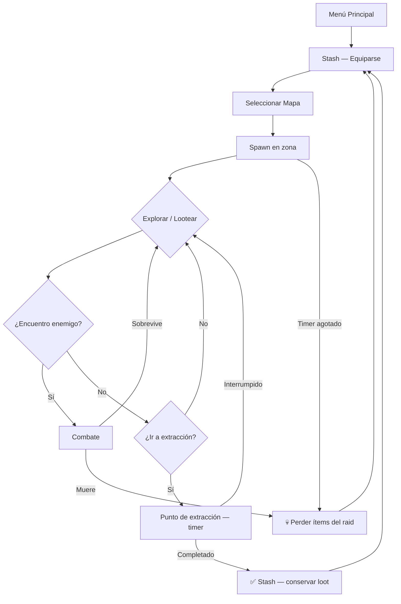

# Game Design Document — Escape From Zona Sur

> **Versión:** 1.0  
> **Fecha:** 2026-04-14  
> **Motor:** Godot 4.4 · GDScript  
> **Género:** Extraction Shooter (First-Person)  
> **Referencia principal:** [Road To Vostok](https://roadtovostok.com/), [Escape From Tarkov](https://escapefromtarkov.fandom.com/wiki/Escape_from_Tarkov_Wiki)

---

## 1. Visión del juego

**Escape From Zona Sur** es un **survival extraction shooter en primera persona** ambientado en la Zona Sur del Gran Buenos Aires y Capital Federal. Argentina atraviesa una crisis socioeconómica terminal: la infraestructura colapsó, las fuerzas del orden se corrompieron y facciones armadas controlan los barrios. El jugador es un sobreviviente que debe infiltrarse en zonas de cuarentena urbana, recolectar recursos para subsistir y llegar a los puntos de extracción antes de que el tiempo se agote o lo maten.

### Pilares de diseño

| Pilar | Descripción |
|-------|-------------|
| 🎯 **Extracción** | Entra a la zona, recoge loot, llega al punto de extracción. Lo que no extraés, lo perdés. |
| 💀 **Riesgo permanente** | La muerte tiene consecuencias reales: perdés todo lo que llevás equipado en el raid. |
| 🧠 **IA de facciones** | Enemigos con comportamiento táctico diferenciado por facción — no son zombies genéricos. |
| 🔧 **Inventario y crafteo** | Sistema de peso con slots, durabilidad de ítems y crafteo básico de supervivencia. |
| 📖 **Narrativa ambiental** | El lore se descubre, no se expone: documentos, grafitis, radio AM, ambientación sonora. |

### Identidad visual

Estética realista-sucia: calles de asfalto roto, veredas con baldosas flojas, rejas oxidadas, carteles de comercios abandonados, cables colgando, grafitis políticos. Paleta desaturada con acentos de color en zonas de peligro.

---

## 2. Plataforma y público objetivo

| Atributo | Valor |
|----------|-------|
| **Plataforma** | PC (Windows, Linux) |
| **Motor** | Godot 4.4+ |
| **Lenguaje** | GDScript |
| **Perspectiva** | Primera persona (FPS) |
| **Modo de juego** | Singleplayer (v1.0) — multijugador cooperativo como objetivo futuro |
| **Clasificación estimada** | +16 (violencia, temática madura) |
| **Público objetivo** | Jugadores de extraction shooters y survival hardcore que buscan una ambientación latinoamericana única |
| **Tiempo de sesión** | 30–45 minutos por raid |
| **Distribución** | itch.io (Early Access), Steam (versión completa) |

---

## 3. Loop de juego principal

### Diagrama de flujo

```
[Menú principal]
      │
      ▼
[Stash del jugador — equiparse]
      │
      ▼
[Seleccionar mapa y raid]
      │
      ▼
[Entrar a la zona — spawn aleatorio]
      │
      ├──► [Explorar / Lootear contenedores]
      │          │
      │          ▼
      │    [Encuentro con enemigos / facciones]
      │          │
      │    [Combate — sobrevivir o huir]
      │          │
      ├──────────┘
      │
      ▼
[Llegar al punto de extracción]
      │
      ├──► ÉXITO ──► [Stash — vender / craftear / equipar]
      │                        │
      │                        └──► [Siguiente raid]
      │
      └──► MUERTE ──► [Perder ítems equipados en el raid]
                               │
                               └──► [Volver al stash con lo que quede]
```

### Descripción del loop

1. **Preparación (Stash):** El jugador revisa su inventario persistente, elige qué armas, armaduras y consumibles llevar al raid. Lo que lleva, lo arriesga.
2. **Selección de raid:** Elige mapa (Adrogue o CABA) y confirma entrada. El mapa muestra spawn points y puntos de extracción generales.
3. **Spawn:** El jugador aparece en uno de los spawn points aleatorios del mapa. El timer de raid comienza (30 minutos por defecto).
4. **Exploración y looteo:** Recorre el mapa buscando contenedores con loot (casas, comisarías, vagones, depósitos). Cada contenedor tiene una loot table con probabilidades.
5. **Encuentros:** Facciones enemigas patrullan el mapa. El combate es letal y rápido — evitar o enfrentar es una decisión constante.
6. **Extracción:** El jugador debe llegar a uno de los puntos de extracción activos y permanecer en la zona el tiempo requerido. Si lo logra, conserva todo el loot.
7. **Consecuencia de muerte:** Si muere, pierde todos los ítems que llevaba equipados en el raid. Solo el stash es permanente.

### Mermaid — Game Loop



---

## 4. Mecánicas de gameplay

### 4.1 Sistema de movimiento

El jugador controla un personaje en primera persona con movimiento FPS clásico.

| Parámetro | Valor | Notas |
|-----------|-------|-------|
| Velocidad caminando | 5.0 m/s | Movimiento por defecto |
| Velocidad sprint | 8.0 m/s | Mantener Shift izq. Genera ruido detectable por IA |
| Velocidad agachado | 2.5 m/s | Menos ruidoso, perfil más bajo |
| Velocidad de salto | 4.5 m/s (vertical) | Solo si `is_on_floor()` |
| Gravedad | 9.8 m/s² | Godot default |
| Altura agachado | 1.0 m | Reduce collision shape |
| Sensibilidad mouse | 0.002 | Configurable en opciones |

**Head bob:** La cámara tiene un movimiento sutil de balanceo al caminar (`bob_frequency: 2.0 ciclos/s`, `bob_amplitude: 0.05 m`). Desactivable en opciones.

**Detección de superficie:** Un raycast bajo el jugador detecta el tipo de superficie (asfalto, tierra, madera, metal, agua) para variar el sonido de pasos.

**Pasos y ruido:**
- Intervalo de pasos caminando: 0.5 s
- Intervalo de pasos corriendo: 0.3 s
- Correr emite ruido detectable por el sistema de IA a través de `EventBus.noise_emitted`

### 4.2 Sistema de combate

El combate es letal y táctico. Pocas balas matan — tanto al jugador como a los enemigos.

#### Armas

| Arma | Tipo | Daño | Cadencia | Cargador | Peso |
|------|------|------|----------|----------|------|
| Pistola Bersa 9mm | Pistola | 25 HP | Semi-auto | 15 balas | 0.9 kg |
| *(Futuras armas en sprints posteriores)* | — | — | — | — | — |

#### Mecánicas de arma
- **Disparo:** Click izquierdo. Cada disparo emite `EventBus.weapon_fired` con posición y genera ruido (`loudness: 1.0`).
- **Recarga:** Tecla R. Emite `EventBus.weapon_reloaded`.
- **Munición:** Se trackea como `current / reserve`. Señal `EventBus.ammo_changed` para actualizar el HUD.
- **Retroceso:** Desplazamiento de cámara en cada disparo (a implementar).
- **Durabilidad:** Las armas tienen durabilidad (`max_durability: 100.0`). Cada disparo reduce durabilidad. Un arma degradada tiene más dispersión y puede encasquillarse.

#### Daño y salud

| Parámetro | Valor | Notas |
|-----------|-------|-------|
| HP máximo jugador | 100 HP | Base sin armadura |
| HP enemigo básico | 80 HP | Variable por facción (ver sección 5) |
| Daño pistola 9mm | 25 HP/disparo | 4 disparos para matar jugador sin armadura |
| Reducción por armadura | 30% | Chaleco básico; varía por tipo |

#### Modelo de daño
1. El proyectil impacta → se calcula daño base del arma
2. Si el objetivo tiene armadura, se aplica reducción porcentual
3. Se aplica daño al `HealthComponent` del objetivo
4. Si HP ≤ 0 → muerte (señal `player_died` o `enemy_died`)

### 4.3 Sistema de inventario

Sistema de inventario basado en **peso** (no en cuadrícula espacial tipo Tetris).

| Parámetro | Valor |
|-----------|-------|
| Peso máximo | 20.0 kg |
| Stacking | Ítems stackeables según `max_stack` del ItemData |
| Persistencia | Solo el stash persiste entre raids |

#### Tipos de ítems

| Tipo | Enum | Ejemplos |
|------|------|----------|
| `WEAPON` | 0 | Pistola Bersa 9mm |
| `AMMO` | 1 | Munición 9mm |
| `ARMOR` | 2 | Chaleco antibalas |
| `MEDICAL` | 3 | Botiquín, venda |
| `FOOD` | 4 | Alfajor (healing lento) |
| `KEY` | 5 | Llaves de acceso a zonas |
| `MISC` | 6 | Items de valor para vender |

#### Ítems iniciales (v1)

| ID | Nombre | Tipo | Peso | Stack | Valor base | Durabilidad |
|----|--------|------|------|-------|------------|-------------|
| `pistol_9mm` | Pistola Bersa 9mm | WEAPON | 0.9 kg | 1 | 5000 $ | Sí (100) |
| `ammo_9mm` | Munición 9mm | AMMO | 0.1 kg | 60 | 50 $ | No |
| `medkit_basic` | Botiquín básico | MEDICAL | 0.5 kg | 3 | 2000 $ | No |
| `bandage` | Venda | MEDICAL | 0.2 kg | 5 | 500 $ | No |
| `food_alfajor` | Alfajor Capitán del Espacio | FOOD | 0.1 kg | 10 | 100 $ | No |
| `armor_vest` | Chaleco táctico | ARMOR | 3.0 kg | 1 | 8000 $ | Sí (100) |
| `cash_pesos` | Fajos de pesos | MISC | 0.05 kg | 99 | 1 $/u | No |

#### Flujo de inventario
1. **Recoger:** El jugador interactúa con un contenedor o loot del mundo → `InventoryComponent.add_item()` verifica peso → si cabe, agrega y emite `EventBus.item_picked_up`
2. **Soltar:** Desde la UI de inventario, drag & drop fuera de la cuadrícula → `EventBus.item_dropped` → ítem aparece en el mundo
3. **Sobrepeso:** Si el peso total supera `max_weight`, se emite `EventBus.inventory_full` y se rechaza el ítem
4. **Muerte:** Al morir en raid, se pierden todos los ítems del inventario activo. El stash no se toca.

### 4.4 Sistema de extracción

La extracción es el objetivo central de cada raid. Llegar a un punto de extracción y completar el timer es la única forma de conservar el loot obtenido.

| Parámetro | Valor | Notas |
|-----------|-------|-------|
| Puntos de extracción por mapa | 3 | Mínimo 1 siempre activo |
| Tiempo de extracción | 5.0 s | Permanecer en la zona sin interrupciones |
| Decay al salir de la zona | 0.5× velocidad | El progreso se pierde parcialmente si salís |
| Timer de raid | 30 min (1800 s) | Al expirar: muerte automática |

#### Mecánica de extracción
1. El jugador entra en un `Area3D` marcado como zona de extracción → `EventBus.extraction_zone_entered`
2. Un timer de progreso incrementa de 0.0 a 1.0 durante `extraction_time` segundos
3. Si el jugador sale antes de completar → el progreso decae a 0.5× velocidad → `EventBus.extraction_zone_exited`
4. Al llegar a 1.0 → `EventBus.extraction_completed` → raid exitoso, se conserva el loot
5. El HUD muestra una barra de progreso durante la extracción

#### Zonas de extracción activas
- Al menos 1 de las 3 zonas siempre está activa (`is_active: true`)
- Las zonas pueden desactivarse por eventos del mundo o por script
- Las zonas activas son visibles como marcadores verdes en la brújula del HUD

### 4.5 Sistema de progresión

La progresión es **horizontal** (más opciones) en lugar de vertical (más poder bruto).

#### Progresión entre raids
- **Stash:** Inventario persistente guardado en `user://stash.json`. Acumular recursos entre raids.
- **Comerciante NPC:** Comprar y vender ítems con pesos argentinos. Los precios fluctúan (economía dinámica futura).
- **Crafteo básico:** Combinar recursos para crear ítems (ej: venda + alcohol → botiquín). *Sprint 3+.*
- **Reputación de facciones:** Acciones en raid afectan la relación con facciones (enemigos neutrales o más agresivos). *Sprint 4+.*

#### Progresión dentro del raid
- Encontrar mejor loot a medida que se avanza hacia zonas más peligrosas del mapa
- Desbloquear acceso a áreas cerradas con llaves (`KEY` items)
- Las zonas más profundas tienen loot tables con mayor valor pero más enemigos

---

## 5. Facciones y enemigos

Cuatro facciones controlan distintas zonas del mapa. Cada una tiene comportamiento de IA diferenciado implementado con **Beehave** (behavior trees).

### Tabla de facciones

| Facción | Zona principal | Comportamiento | HP base | Loot table |
|---------|---------------|----------------|---------|------------|
| **Bonaerenses** | Estación de tren, comisaría | Organizado: patrulla, busca cobertura, dispara desde posición. Alerta a escuadra. | 100 HP | `enemy_bonaerense` |
| **La Banda** | Villa, pasillos, barrio | Agresivo: flanquea, carga, retrocede si está herido para curarse. | 80 HP | `enemy_banda` |
| **Sobrevivientes** | Comercios, zonas residenciales | Evasivo: huye si puede, ataca solo si está acorralado o tiene ventaja. | 60 HP | `enemy_survivor` |
| **Los Narcos** | Zona industrial, depósitos | Territorial y coordinado: no ataca si no invadís su zona, embosca en equipo. | 120 HP | `enemy_narco` |

### Behavior trees por facción

#### Bonaerense (Policía corrupta)
```
Selector
├── Sequence [Estoy muerto?] → Die
├── Sequence [Veo al jugador?] → Buscar cobertura → Disparar
├── Sequence [Escuché ruido?] → Alertar escuadra → Investigar posición
└── Sequence [default] → Patrullar punto asignado
```

#### La Banda (Pandillas locales)
```
Selector
├── Sequence [Salud baja?] → Retroceder → Curarse
├── Sequence [Veo al jugador?] → Flanquear → Disparar
├── Sequence [Escuché ruido?] → Gritar (notificar) → Cargar hacia origen
└── Sequence [default] → Patrullar territorio
```

#### Sobreviviente (Civiles armados)
```
Selector
├── Sequence [Recibí daño?] → Huir
├── Sequence [Veo al jugador?] → ¿Tiene arma? → Huir o Atacar
└── Sequence [default] → Vagar aleatoriamente
```

#### Los Narcos (Cartel territorial)
```
Selector
├── Sequence [Jugador en territorio?] → Coordinar escuadra → Cercar
├── Sequence [Escuché disparo?] → Coordinar posiciones → Emboscar
└── Sequence [default] → Guardia fija + Patrulla perimetral
```

### Sistema de detección (SensorComponent)

| Parámetro | Valor |
|-----------|-------|
| Rango de visión | 15.0 m |
| Ángulo de visión (FOV) | 90° total |
| Rango de audición | 25.0 m |
| Tasa de sospecha (viendo al jugador) | +20.0 /s |
| Decay de sospecha (sin visión) | -10.0 /s |
| Umbral de combate | 100.0 (suspicion) |
| Incremento por sonido escuchado | +40.0 instantáneo |

**Rango efectivo de sonido** = `hearing_range × loudness`. Un disparo (`loudness: 1.0`) se escucha a 25 m. Pasos en sprint se escucharían a menor rango.

### Parámetros de movimiento enemigo

| Parámetro | Valor |
|-----------|-------|
| Velocidad de movimiento | 3.0 m/s |
| Radio de patrulla | 10.0 m |
| Tiempo de animación de muerte | 3.0 s |

---

## 6. Mapas

### 6.1 Adrogue

**Ambientación:** Suburbio bonaerense colapsado. Casas bajas con rejas, veredas rotas, la estación de tren como punto de referencia central, comercios saqueados sobre la avenida principal, y una zona industrial en la periferia.

**Dimensiones:** 200 × 200 metros (aprox. 4 manzanas reales de Adrogue).

**Referencia real:** [Google Maps — Adrogue](https://maps.google.com/?q=Adrogue,+Buenos+Aires)

#### Layout del mapa

```
┌─────────────────────────────────────────────────────────────────┐
│  MAPA: ADROGUE                                                  │
│                                                                 │
│  [Spawn A]──► BARRIO RESIDENCIAL ──► COMERCIOS SAQUEADOS       │
│                     │                        │                  │
│                     ▼                        ▼                  │
│               ESTACIÓN DE TREN ◄──── VILLA / PASILLOS          │
│                     │                                           │
│                     ▼                                           │
│               [Extracción 1]         [Extracción 2]             │
│                                      (ruta hacia CABA)          │
│                                                                 │
│  [Spawn B]──► ZONA INDUSTRIAL ──────────────────► [Ext 3]      │
└─────────────────────────────────────────────────────────────────┘
```

#### Zonas del mapa

| Zona | Tamaño aprox. | Facciones | Loot table | Dificultad |
|------|--------------|-----------|------------|------------|
| **Barrio residencial** | 40 × 40 m | Sobrevivientes | `residential_house` | ⭐ Baja |
| **Estación de tren** | 40 × 40 m | Bonaerenses | `train_station` | ⭐⭐ Media |
| **Comercios saqueados** | 40 × 40 m | La Banda | `residential_house` | ⭐⭐ Media |
| **Villa / Pasillos** | 30 × 30 m | La Banda | `generic` | ⭐⭐⭐ Alta |
| **Zona industrial** | 50 × 40 m | Los Narcos | `industrial_zone` | ⭐⭐⭐ Alta |

#### Paleta CSG por zona (blockout)

| Zona | Color CSG | Hex |
|------|-----------|-----|
| Barrio residencial | Gris claro | `#AAAAAA` |
| Estación de tren | Marrón | `#8B6914` |
| Comercios | Beige | `#D2B48C` |
| Zona industrial | Gris oscuro | `#555555` |
| Puntos de extracción | Verde emisivo | `#00FF00` |

#### Puntos de extracción — Adrogue

| Extracción | Ubicación | Tiempo | Notas |
|-----------|-----------|--------|-------|
| Ext. 1 | Sur de la Estación de tren | 5 s | Siempre activo |
| Ext. 2 | Este — ruta hacia CABA | 5 s | Activo aleatoriamente |
| Ext. 3 | Sureste — Zona industrial | 5 s | Activo aleatoriamente |

#### Contenedores de loot

12+ contenedores distribuidos por el mapa:
- **Barrio residencial:** 4 contenedores (casas, autos abandonados)
- **Estación de tren:** 3 contenedores (vagones, oficina de boletería)
- **Comercios:** 3 contenedores (almacén, farmacia, ferretería)
- **Zona industrial:** 2 contenedores (depósito, container de carga)

Distancia de interacción con contenedores: **2.5 m**.

### 6.2 Capital Federal

> *Mapa planificado para Sprint 4. Diseño preliminar.*

**Ambientación:** Buenos Aires urbano colapsado. Desde el Riachuelo (frontera narrativa) pasando por La Boca y San Telmo hasta el Microcentro como zona final de alto riesgo.

#### Layout preliminar

```
┌─────────────────────────────────────────────────────────────────┐
│  MAPA: CAPITAL FEDERAL                                          │
│                                                                 │
│  [Spawn]──► RIACHUELO (frontera) ──► LA BOCA colapsada         │
│                                            │                    │
│                                            ▼                    │
│                                      SAN TELMO                  │
│                                       (ruinas)                  │
│                                            │                    │
│                                            ▼                    │
│                                    MICROCENTRO                  │
│                                   (zona final)                  │
│                                            │                    │
│                                     [Extracción]                │
└─────────────────────────────────────────────────────────────────┘
```

#### Elementos planificados
- Eventos dinámicos (tiroteos entre facciones, derrumbes)
- Jefes de zona únicos
- Mayor densidad de enemigos y mejor loot
- Clima dinámico más intenso (tormenta eléctrica sobre el Riachuelo)

---

## 7. Economía del juego

### Moneda
- **Pesos argentinos ($)** — moneda principal del juego
- Se obtienen looteando `cash_pesos` o vendiendo ítems al comerciante NPC

### Tabla de valores base

| Ítem | Valor de compra | Valor de venta | Notas |
|------|----------------|----------------|-------|
| Pistola Bersa 9mm | 5000 $ | 2500 $ | 50% al vender |
| Munición 9mm (×1) | 50 $ | 25 $ | — |
| Botiquín básico | 2000 $ | 1000 $ | — |
| Venda | 500 $ | 250 $ | — |
| Alfajor | 100 $ | 50 $ | — |
| Chaleco táctico | 8000 $ | 4000 $ | — |
| Cash pesos (×1) | — | 1 $ | Se lootea en fajos |

### Rango de cash por loot table

| Loot table | Cash mínimo | Cash máximo | Notas |
|------------|-------------|-------------|-------|
| `generic` | 100 $ | 500 $ | Contenedores comunes |
| `residential_house` | 100 $ | 500 $ | Casas residenciales |
| `train_station` | 200 $ | 2000 $ | Alto valor — zona peligrosa |
| `industrial_zone` | 100 $ | 1000 $ | Medio-alto |
| `enemy_bonaerense` | 100 $ | 500 $ | Drop de policías |
| `enemy_banda` | 50 $ | 300 $ | Drop de pandilleros |
| `enemy_survivor` | 50 $ | 200 $ | Drop de sobrevivientes |
| `enemy_narco` | 500 $ | 3000 $ | Mejor drop del juego |

### Economía de riesgo-recompensa

El diseño económico refuerza el loop de riesgo:
- **Llevar equipo caro al raid** te da ventaja en combate pero el riesgo de perderlo es mayor
- **Raids "zero to hero"** (entrar con nada) son posibles pero muy difíciles — encontrar un arma en el mapa es raro
- **El comerciante** compra al 50% del valor base — incentiva usar ítems en vez de venderlos
- **El stash** tiene capacidad limitada — no podés acumular infinitamente sin usar o vender

---

## 8. Narrativa (resumen)

### Premisa

Argentina, futuro cercano. Una crisis económica y social sin precedentes provocó el colapso de los servicios públicos, la corrupción total de las fuerzas de seguridad y la fragmentación del Gran Buenos Aires en zonas controladas por facciones armadas. El gobierno nacional se replegó a los centros urbanos de CABA, dejando la Zona Sur como tierra de nadie.

El jugador es un sobreviviente anónimo que vive en el borde de la zona de cuarentena. Su objetivo: reunir recursos para escapar hacia el norte, atravesando las zonas más peligrosas de Buenos Aires hasta llegar a Capital Federal.

### Facciones y motivaciones

| Facción | Motivación | Territorio |
|---------|-----------|-----------|
| **Bonaerenses** | Policía de la provincia corrupta. Controlan zonas estratégicas (estaciones, comisarías) y cobran peaje. | Estaciones, rutas principales |
| **La Banda** | Pandillas locales que surgieron del vacío de poder. Agresivos, territorialistas. | Villas, barrios populares, pasillos |
| **Sobrevivientes** | Civiles armados que solo quieren vivir. No buscan pelea, pero se defienden. | Comercios, casas, zonas residenciales |
| **Los Narcos** | Cartel que controla la zona industrial y la ruta de contrabando. Los más peligrosos y organizados. | Zona industrial, depósitos |

### Narrativa ambiental

El lore se transmite a través de:
- **Documentos encontrables:** Notas, diarios, avisos oficiales en contenedores y paredes
- **Radio AM:** Transmisiones ambientales que el jugador escucha mientras explora
- **Grafitis:** Mensajes de las facciones pintados en paredes y persianas
- **Diálogos del comerciante:** El NPC comerciante comenta sobre el estado del mundo
- **Ambiente sonoro:** Perros ladrando, sirenas lejanas, helicópteros, tiros a la distancia

### Arco narrativo principal (5 misiones — Sprint 4+)

1. *"Primer paso"* — Completar tu primera extracción en Adrogue
2. *"Contacto"* — Encontrar al comerciante y establecer una ruta de suministros
3. *"El puente"* — Llegar al Riachuelo y descubrir la ruta hacia CABA
4. *"Territorio hostil"* — Atravesar La Boca controlada por Los Narcos
5. *"Escape"* — Llegar al punto de extracción final en el Microcentro

---

## 9. Balance preliminar (tablas)

### 9.1 Parámetros generales

| Parámetro | Valor | Notas |
|-----------|-------|-------|
| Salud máxima jugador | 100 HP | Sin armadura |
| Velocidad caminando | 5.0 m/s | — |
| Velocidad sprint | 8.0 m/s | Genera ruido |
| Velocidad agachado | 2.5 m/s | Sigiloso |
| Capacidad de inventario | 20.0 kg | — |
| Tiempo de raid | 30 min (1800 s) | Timer global |
| Puntos de extracción por mapa | 3 | Mín. 1 activo |
| Tiempo de extracción | 5.0 s | Permanecer en zona |

### 9.2 Salud por tipo de entidad

| Entidad | HP | Armadura base |
|---------|-----|--------------|
| Jugador | 100 | 0% (sin chaleco) |
| Jugador + chaleco | 100 | 30% reducción |
| Bonaerense | 100 | 20% (chaleco policial) |
| La Banda | 80 | 0% |
| Sobreviviente | 60 | 0% |
| Los Narcos | 120 | 15% |

### 9.3 TTK (Time-To-Kill) estimado con pistola 9mm (25 HP/disparo)

| Objetivo | Disparos para matar | TTK aprox. (semi-auto) |
|----------|---------------------|----------------------|
| Jugador sin armadura | 4 | ~1.2 s |
| Jugador con chaleco | 6 | ~1.8 s |
| Bonaerense | 5 | ~1.5 s |
| La Banda | 4 | ~1.2 s |
| Sobreviviente | 3 | ~0.9 s |
| Los Narcos | 5-6 | ~1.5-1.8 s |

### 9.4 Loot tables — Rolls por tabla

| Loot table | Rolls | Ítems posibles |
|------------|-------|---------------|
| `generic` | 2 | Cash, alfajor, venda |
| `residential_house` | 3 | Alfajor, venda, cash, botiquín |
| `police_station` | 5 | Pistola, munición 9mm, chaleco, venda |
| `train_station` | 4 | Cash alto, alfajor, botiquín |
| `industrial_zone` | 4 | Munición, cash, venda, chaleco |
| `enemy_bonaerense` | 2 | Munición, cash, venda |
| `enemy_banda` | 2 | Cash, alfajor, munición |
| `enemy_survivor` | 1 | Alfajor, venda, cash |
| `enemy_narco` | 3 | Cash alto, munición, pistola, botiquín |

### 9.5 Economía — Flujo estimado por raid

| Escenario | Ingreso estimado | Gasto estimado | Balance |
|-----------|-----------------|----------------|---------|
| Raid exitoso (bajo riesgo) | 1000–3000 $ | 0 $ (sin equipo) | +1000–3000 $ |
| Raid exitoso (equipado) | 3000–8000 $ | 6000 $ (pistola + chaleco) | -3000 a +2000 $ |
| Muerte (equipado) | 0 $ | 13000 $ (pistola + chaleco) | -13000 $ |
| Muerte (sin equipo) | 0 $ | 0 $ | 0 $ |

**Objetivo de balance:** Un jugador promedio debería poder sostener su equipo con 2 raids exitosos por cada muerte equipada.

---

## Apéndice A — Referencias técnicas

| Referencia | Enlace |
|-----------|--------|
| Arquitectura del proyecto | [`docs/architecture.md`](../architecture.md) |
| Señales EventBus | [`src/autoloads/EventBus.gd`](../../src/autoloads/EventBus.gd) |
| Estado del raid | [`src/autoloads/GameState.gd`](../../src/autoloads/GameState.gd) |
| Agentes del proyecto | [`docs/AGENTS.md`](../AGENTS.md) |
| Tablero de proyecto | [`DASHBOARD.md`](../../DASHBOARD.md) |

## Apéndice B — Historial de versiones

| Versión | Fecha | Cambios |
|---------|-------|---------|
| 1.0 | 2026-04-14 | GDD inicial: visión, mecánicas, balance, mapas, facciones, economía, narrativa |
